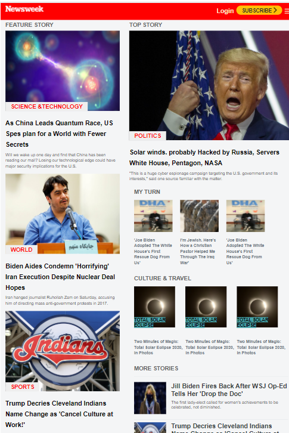

# Newsweek website clone using Bootstrap and SASS.

>
This project is a responsive clone of newsweek (newsweek.com) website. This was built using sass and Bootstrap. We used Bootstrap for making it responsive i.e. Tablet UI, Desktop UI and Moble UI. Images are made responsive by using cards, flexboxes, Jumbotron, and breakpoints(media queries.
 #Screen shot
 
 

## Built With

- SASS
- HTML & CSS
- Font Awesome Icons
- Linters
- VsCode
- Gitflows

## Live Demo

[Live Link](https://chrystalme.github.io/newsweek-web-clone/)

## Getting Started

**This is an example of how you may give instructions on setting up your project locally.**
**Modify this file to match your project, remove sections that don't apply. For example: delete the testing section if the current project doesn't require testing.**

👤 **Author1**

- GitHub: [@chrystalme](https://github.com/chrystalme)
- Twitter: [@afam_ifeanyi](https://twitter.com/afam_ifeanyi)
- LinkedIn: [Afam ifeanyi(chrys) Malieze](https://linkedin.com/in/afam-ifeanyi-chrys-malieze-63876576)

👤 **Author2**

- GitHub: [@sohaibya](https://github.com/sohaibya)
- Twitter: [Sohaib](https://twitter.com/sohaib)

## Acknowledgments

- Hat tip to anyone whose code was used
- Inspiration
- etc

## 📝 License
This project is [MIT](https://mit-license.org) licensed.
